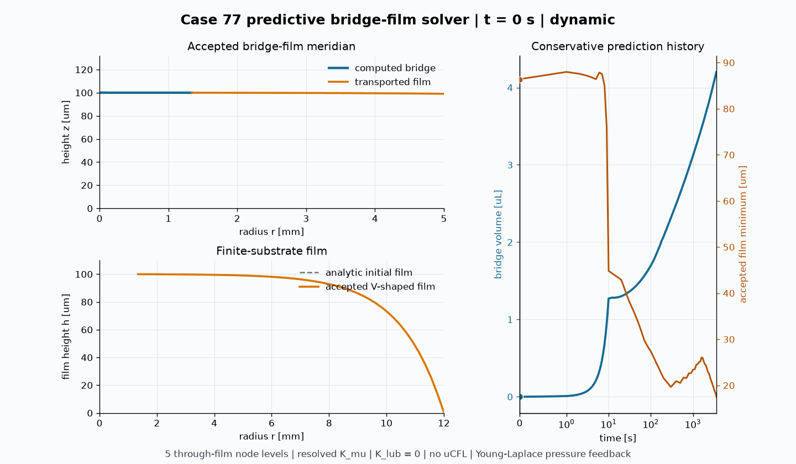

# Case 77: predictive capillary bridge-film solver

Case 77 is the most predictive solver in this case series. It computes the
bridge, contact line, surrounding V-shaped film, and finite-substrate rim from
geometry, material properties, conservative liquid transfer, and the coupled
PR33/PR35/PR37 operators. Experimental profiles are used only after the
forward solve for validation; they do not drive the prediction.

The included GIF is the accepted 0--3600 s prediction:



## What is new

- **Five through-film node levels:** four uniform P1 elements resolve the
  no-slip/shear-free velocity profile through the film thickness. This means
  five vertical node levels, not five radial sample points. The resulting
  mobility error is 1.5625%, below the declared 2% discretization tolerance.
- **Resolved physical viscosity:** the PR35 tetrahedral Cauchy operator
  assembles `K_mu` using the physical viscosity. No additional `K_lub`
  momentum matrix is assembled, avoiding double-counting thin-gap drag.
- **No `uCFL` velocity cap:** the accepted velocity is the PR35 solution.
  CFL and mesh-quality checks reject or retry inadmissible steps; they do not
  overwrite the solved nodal velocity.
- **Computational V-shaped film:** the V is the accepted, conservatively
  transported film state. It is not imposed from an experimental profile or
  replaced after the solve.
- **Pressure feedback:** in the low-inertia Stokes branch, the current
  computed bridge volume selects a zero-contact-angle Young--Laplace state.
  Its liquid pressure enters the next PR35 conservative contact-supply active
  set. The Young--Laplace contact radius never overwrites the material PR37
  contact line.
- **Adaptive transient/Stokes momentum:** backward-Euler momentum is retained
  while inertia matters. The solver switches to the zero-inertia form only
  after the computed inertial-force ratio remains below 1% for five solves;
  a Stokes trial above 5% returns to the transient solve.
- **Analytic finite substrate:** Case 77 replaces the inherited compact
  smoothstep rim fitted to a measured initial profile with the capillary-
  gravity Bessel solution derived from `rho`, `g`, `gamma`, `h0`, and the
  substrate radius `L`.

## Why it works

The complete physical chain is retained:

```text
Heron + Cox + Cauchy + pressure + hydrostatic forces
    -> PR35 velocity
    -> accepted nodal displacement
    -> updated bridge and film geometry
```

The exact three-dimensional Heron force is assembled on the closed surface,
while the exact-axisymmetric PR35 trial and test space removes the unused
azimuthal velocity mode. PR37 enters as a Cox force inside the momentum solve,
not as a prescribed contact speed. Every accepted contact-line displacement
must match the displacement predicted from the PR35 velocity within the
recorded tolerance.

Bridge growth is supplied by a matching decrease of film inventory. The
axisymmetric film equation transports the local and far-field deficits, and
the donor/receiver update records the net volume residual. This couples the
strong early capillary suction to the slow thin-film supply without injecting
liquid or prescribing a bridge-growth curve.

## Governing equations

The Young--Laplace bridge is written in meridional arc length `s`:

```text
dr/ds   = cos(phi)
dz/ds   = sin(phi)
dphi/ds = DeltaP/gamma + (rho*g/gamma)*z - sin(phi)/r
```

The surrounding axisymmetric film obeys

```text
p = p_air + rho*g*h + gamma*kappa
dh/dt = -(1/r) d(r*q)/dr
q = -h^3/(3*mu) dp/dr
```

The finite circular substrate starts from

```text
l_c = sqrt(gamma/(rho*g))
h(r) = h0 [I0(L/l_c) - I0(r/l_c)] / [I0(L/l_c) - 1]
```

The Cox--Voinov relation and discrete line force are

```text
theta_d^3 = theta_e^3 + 9 (mu*U_cl/gamma) ln(L_macro/lambda)
F_Cox,i = gamma [cos(theta_e) - cos(theta_d)] ell_i d_adv,i
```

The tetrahedral momentum/volume equations are

```text
F_Heron,i = -gamma (HN dA)_i
sigma_T = mu [grad(u_T) + grad(u_T)^T]
F_Cauchy,i = -sum_T |T| sigma_T grad(N_i)

(M/dt + K_mu + K_gamma) u^(n+1) + B^T p
    = M u^n/dt + F_Heron + F_Cox + F_hydro
B u^(n+1) = (V_target - V)/dt
```

`K_gamma` is only the implicit linearization of the unchanged Heron force; it
is not an additional physical force.

## Install

From the repository root:

```bash
python3 -m venv .venv
source .venv/bin/activate
python3 -m pip install -e '.[vis]' gmsh
```

The solver requires Python 3.9 or newer, NumPy, SciPy, Matplotlib, Pillow,
ContourPy, HyperCT, and the Gmsh Python package.

## Run

Enter this directory:

```bash
cd cases_dynamic/liquid_bridge_coupled_collision
```

A short operator/mesh smoke run is:

```bash
python3 Case_77_siekman2025_adaptive_computational_shape_solver.py \
  --out-dir case77_smoke --max-steps 2 --record-every 1
```

The resolved 0--10 s prediction is:

```bash
python3 Case_77_siekman2025_adaptive_computational_shape_solver.py \
  --prediction-0to10 --out-dir case77_prediction_0to10
```

For the long prediction, first compute the transient startup and then restart
with the larger low-inertia step. Output directories must be new because the
solver deliberately refuses to overwrite an existing prediction.

```bash
python3 Case_77_siekman2025_adaptive_computational_shape_solver.py \
  --prediction --final-time-s 100 \
  --snapshot-interval-s 10 \
  --out-dir case77_prediction_0to100

python3 Case_77_siekman2025_adaptive_computational_shape_solver.py \
  --prediction --final-time-s 3600 \
  --restart-from case77_prediction_0to100 --restart-time-s 100 \
  --continuation-dt-s 20 --snapshot-interval-s 100 \
  --out-dir case77_prediction_0to3600
```

## Create the GIF

The renderer reads only accepted Case 77 Young--Laplace/film states and the
solver history. It has no dependency on renderers from earlier cases.

```bash
python3 render_case77_adaptive_computational_shape_gif.py \
  --out-dir case77_prediction_0to3600 --duration-ms 420
```

For a quick renderer check, add `--max-frames 3 --output /tmp/case77.gif`.
Without `--output`, the GIF is written inside the selected output directory as
`case77_flux_inventory_prediction_0to3600.gif`.

## Main outputs

- `case77_real_mesh_evolution_history.csv`: solver state, force, velocity,
  conservation, adaptive-mode, and PR37 displacement audit.
- `mesh_states/`: accepted transported surface states.
- `mesh_states_tetra_volume/`: accepted tetrahedral volume states.
- `young_laplace_mesh_states/`: accepted full-domain bridge/film states used
  by the renderer.
- `case77_through_gap_resolution_audit.json`: five-node mobility convergence,
  `K_lub=0`, and velocity-cap audit.
- `case77_computational_shape_feedback_audit.json`: Young--Laplace pressure
  feedback and no-geometry-overwrite audit.

## References

1. V. D. Siekman, F. Mugele, P. M. Lugt, and D. van den Ende, "Growth
   dynamics of capillary bridges," *Physics of Fluids* 37, 072117 (2025).
   <https://doi.org/10.1063/5.0267643>
2. R. G. Cox, "The dynamics of the spreading of liquids on a solid surface.
   Part 1. Viscous flow," *Journal of Fluid Mechanics* 168, 169--194 (1986).
   <https://doi.org/10.1017/S0022112086000332>
